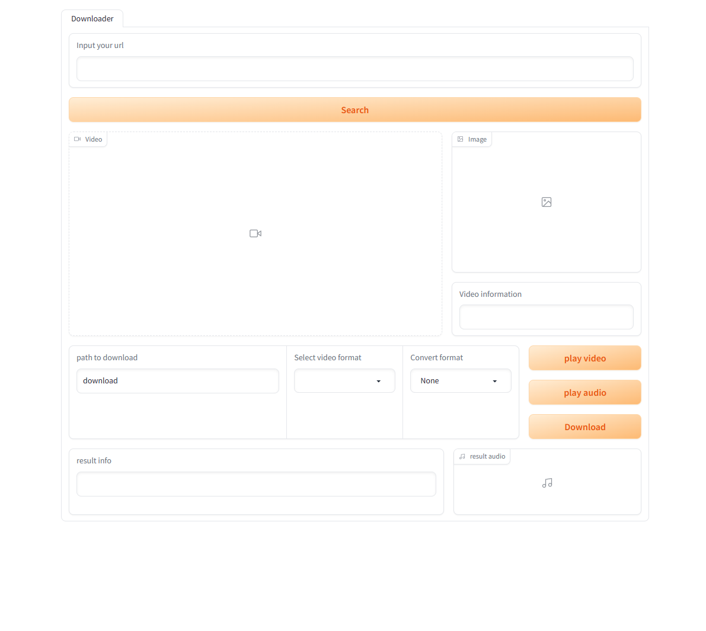

# YTVideoPlayer-webui
YTVideo player


## Requirements
- Python

## Setup
1. Instsall youtube-dl
2. Create environment
```
# anaconda
conda create -n ytdl python=3.9.13
```
```
# Venv
python -m venv ytdl
```
3. Activate environment
```
# anaconda
activate ytdl
```
```
# Venv
source ytdl/Scripts/activate
```
4. Install python requirements
```
pip install -r requirements.txt
```

## How to use
```
python main.py
```


Enter the URL of the YouTube video and press the Search button.

Press one of the three buttons: play video, play audio, download
* play video button: The video will be downloaded in mp4 format and stored in the cache folder. and then will be deleted.
* play audio button: The video will be downloaded in mp3 format and stored in the cache folder. and then will be deleted.
* download button: The video will be saved to the location you set.
